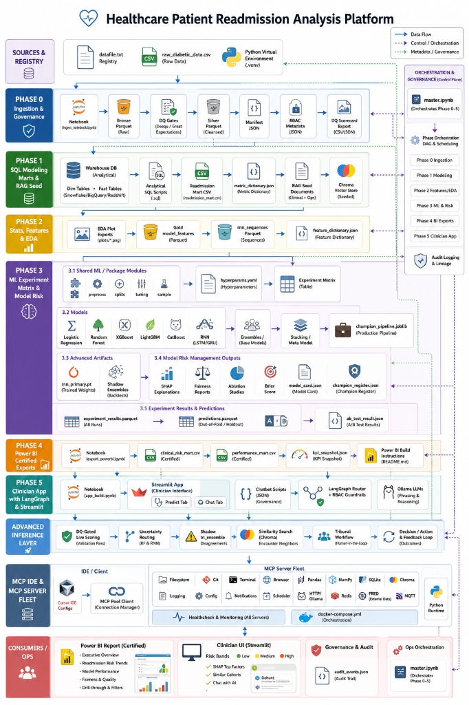

# Hospital Readmission Risk Analytics

Predict which diabetic inpatients are likely to come back within **30 days** of discharge—and show *why*—so follow-up capacity can go to the people who need it most.

Built as an end-to-end analytics and decision-support demo on the public **Diabetes 130-US Hospitals** dataset (~101,766 encounters, 130 U.S. hospitals, 1999–2008). It covers data governance, warehouse marts, EDA, a multi-model experiment matrix, certified BI exports, and an 8-page Streamlit app with role-based access.

> **Disclaimer:** Training / demo project on public data. **Not** a medical device and **not** for standalone clinical decisions. Real use would need hospital governance, IRB where required, and clinical validation. See also [`models/model_card.json`](models/model_card.json) and [`LICENSE`](LICENSE) (MIT).

---

## Table of contents

- [Overview](#overview)
- [Business problem and value](#business-problem-and-value)
- [Dataset and headline metrics](#dataset-and-headline-metrics)
- [Analytical findings](#analytical-findings)
- [Architecture](#architecture)
- [Tech stack](#tech-stack)
- [Repository layout](#repository-layout)
- [Streamlit application](#streamlit-application)
- [Security and access control](#security-and-access-control)
- [Model results](#model-results)
- [Project workflow](#project-workflow)
- [Setup and installation](#setup-and-installation)
- [Run locally](#run-locally)
- [Environment variables](#environment-variables)
- [Usage examples](#usage-examples)
- [Outputs and deliverables](#outputs-and-deliverables)
- [Limits and roadmap](#limits-and-roadmap)
- [Contributing](#contributing)
- [License](#license)
- [Further reading](#further-reading)

---

## Overview

| Item | Detail |
|------|--------|
| **Problem** | 30-day unplanned readmission risk for diabetic inpatients |
| **Data** | Diabetes 130-US Hospitals (`diabetic_data.csv`) |
| **Pipeline** | Phase 0→5 (lake → warehouse → features → ML → exports → app) |
| **App** | Streamlit multipage UI (`app_streamlit.py`) |
| **BI** | Certified CSV marts + optional Power BI ([`powerbi/BUILD_INSTRUCTIONS.md`](powerbi/BUILD_INSTRUCTIONS.md), `Hospital.pbix` in repo) |
| **Tests** | 70 smoke tests via `scripts/smoke_test_gold_standard.py` |

**Intended use** (from model register): *Analytics decision-support only — not a medical device.*

---

## Business problem and value

Unplanned 30-day readmissions are hard on patients and consume beds, nursing time, and post-discharge capacity. Under CMS’s **Hospital Readmission Reduction Program (HRRP)**, hospitals with excess rates can also face financial penalties.

This project is aimed at questions like:

- What is the baseline 30-day readmission rate?
- Where does risk concentrate (specialty, age, prior utilization)?
- Can a care team see elevated risk *before* discharge, with clear drivers?
- Can that view be shared with strict read-only access and role-based ID visibility?

**What you get in practice:** governed data → reproducible metrics → an explainable risk score → dashboards and a scoring form that do not allow editing patient records in the app.

---

## Dataset and headline metrics

From [`data/exports/kpi_snapshot.json`](data/exports/kpi_snapshot.json):

| Metric | Value |
|--------|------:|
| Patients | 71,518 |
| Encounters | 101,766 |
| 30-day readmission rate | ~11.16% |
| Average length of stay | ~4.40 days |
| High-risk rate (snapshot field) | ~1.35% |

Segment patterns below are documented in [`docs/MASTER_REPORT.md`](docs/MASTER_REPORT.md) (not re-derived in this README).

---

## Analytical findings

### EDA and preparation (analyst view)

| Stage | What happens | Where |
|-------|--------------|--------|
| **Ingestion / DQ** | Raw CSV → bronze Parquet → DQ gates → silver | Phase 0 notebook |
| **Warehouse** | Dim/fact modeling, SQL metrics, `mart_readmission` | Phase 1 + [`sql/`](sql/) |
| **EDA** | Distribution and association plots | `data/exports/eda/` |
| **Features** | Leakage-safe gold features (+ sequence inputs for RNN) | Phase 2 |
| **Interpretation** | SHAP drivers, fairness by gender/age, experiment matrix | Phase 3 + Model Insights / ML Performance pages |

EDA plot exports present in the repo:

- `01_readmission_distribution.png`
- `02_age_vs_readmission.png`
- `03_los_vs_readmission.png`
- `04_medication_impact.png`
- `05_admission_type_impact.png`

SQL analysis scripts (12) live under [`sql/`](sql/) (e.g. readmission by age, diagnosis, frequent visitors, LOS, labs).

### Patterns highlighted in the master report

- **Prior utilization:** ≥2 prior inpatient stays → **38.2%** readmit vs **8.4%** with none
- **Heavy utilizers:** ~**2.1%** of patients → **18.7%** of readmissions
- **Length of stay:** 1–2 days **9.1%** vs >10 days **15.6%**
- **Specialty:** Nephrology **24.8%**; Cardiology **15.1%**
- **Age:** ~12% in older bands (70–90); under ~7.5% for ages 20–40

### Top SHAP drivers (champion register)

From [`models/champion_register.json`](models/champion_register.json):

1. Prior inpatient visits (`number_inpatient`)
2. Discharge disposition
3. Total visits
4. Number of diagnoses
5. Length of stay (`time_in_hospital`)

---

## Architecture

<p align="center">
  
</p>

*Diagram: [`architecture_diagram.jpg`](architecture_diagram.jpg). Narrative: [`docs/PROJECT_ARCHITECTURE.md`](docs/PROJECT_ARCHITECTURE.md).*

### Reading the flowchart (left → right)

One pipeline with six build phases, then scoring and consumers:

1. **Phase 0 — Ingestion & governance** — Raw encounters → bronze → DQ gates → silver; manifest, RBAC seed, DQ scorecard.
2. **Phase 1 — Warehouse & RAG seed** — Dim/fact warehouse, readmission mart, Chroma seed for grounded Q&A.
3. **Phase 2 — Stats & features** — EDA, gold features, RNN sequences, feature dictionary.
4. **Phase 3 — ML & model risk** — Multi-model matrix, ensembles, SHAP / fairness / model card, champion pipeline.
5. **Phase 4 — BI exports** — Certified CSV marts and KPI snapshot for reporting / Power BI.
6. **Phase 5 — Clinician app** — Streamlit UI, RBAC, risk scoring, grounded chat (LangGraph + optional Ollama).

Supporting strips in the diagram:

- **Advanced inference** — DQ before score, uncertainty routing, shadow ensemble, similar encounters, tribunal / feedback
- **MCP / Docker** — optional local services for development and chat tooling
- **Control plane** — [`master.ipynb`](master.ipynb) runs Phase 0→5 with audit/lineage hooks

**Consumers:** Power BI / certified marts, Streamlit risk UI, audit trail (`data/nosql/audit_events.json` when generated).

**Warehouse note:** Runtime warehouse is **SQLite** (portfolio scale), typically `data/warehouse/hospital.db` via `DATABASE_URL`. Diagram labels that mention Snowflake/BigQuery/Redshift describe *warehouse-style* modeling, not those cloud engines in this repo.

### Data zones

| Zone | Folder | Consumers |
|------|--------|-----------|
| Raw | `data/raw/` | Phase 0 |
| Lake (bronze/silver/gold) | `data/lake/` | Pipeline / ML |
| Warehouse | `data/warehouse/` | SQL analytics |
| Certified exports | `data/exports/` | Streamlit, Power BI |
| Models / ops | `models/`, `data/nosql/`, `data/vectordb/` | App, audits, RAG |

App and BI should read **exports** and **ops** only—not bronze.

---

## Tech stack

| Layer | Libraries / tools |
|-------|-------------------|
| Language | Python 3.11+ |
| Data | Pandas, NumPy, SciPy, PyArrow (Parquet) |
| Warehouse | SQLAlchemy + SQLite |
| ML | scikit-learn, XGBoost, LightGBM, CatBoost, PyTorch, SHAP, Optuna, joblib |
| App | Streamlit |
| RAG / chat | ChromaDB, LangGraph, LangChain Core; optional Ollama |
| Viz | Matplotlib, Seaborn, Plotly |
| Optional infra | Redis, MQTT, MCP, APScheduler (see `docker-compose.mcp.yml`, [`docs/mcp.md`](docs/mcp.md)) |
| Notebooks | Jupyter / ipykernel, nbclient |

Full pin list: [`requirements.txt`](requirements.txt).

---

## Repository layout

```
app_streamlit.py          # Streamlit entry (st.navigation)
streamlit_app/            # Pages, RBAC, charts, chat security, theme
  app_pages/              # 1_Hospital_Overview … 8_System_Health_Diagnose
data/exports/             # Certified marts, kpi_snapshot, experiments_matrix, eda/
data/lake/                # Medallion parquet (local rebuild)
data/warehouse/           # SQLite warehouse (local rebuild)
models/                   # Champion pipeline, registers, RNN, shadow artifacts
notebooks/                # phase0 … phase5
master.ipynb              # Orchestrates Phase 0→5
ml/                       # Shared ML helpers
inference/                # Routing, shadow, predict path
governance/               # DQ rules used at score time
chatbot/                  # Scripts / grounded Q&A assets
scripts/                  # Smoke tests, indexing, tuning, diagram renders
sql/                      # 12 analytical SQL scripts
docs/                     # Architecture, phase docs, master report
powerbi/                  # Build instructions (+ Hospital.pbix at repo root)
mcp/                      # MCP client / services (optional)
LICENSE                   # MIT
```

Path registry for datasets/artifacts: [`datafile.txt`](datafile.txt).

---

## Streamlit application

**Entry:** [`app_streamlit.py`](app_streamlit.py)
**Pages:** registered in [`streamlit_app/page_registry.py`](streamlit_app/page_registry.py)

| # | Page | Purpose |
|---|------|---------|
| 1 | **Hospital Overview** | Certified KPIs from Phase 4 exports (default landing page) |
| 2 | **Risk Analysis** | Readmission patterns by age, gender, diagnosis |
| 3 | **Patient Behavior** | Visit frequency and medication utilization |
| 4 | **Model Insights** | Feature importance and prediction distribution (gated) |
| 5 | **ML Performance** | Champion metrics, 168-run experiment matrix, calibration (Analyst+) |
| 6 | **Risk Prediction** | Encounter scoring (8-step inference) + clinical-style report |
| 7 | **Grounded Chat** | Scripts / metrics / RAG / SQLite chat (capabilities by role) |
| 8 | **System Health Diagnose** | Prerequisites, runtime services, ML artifact checks |

### User flow

1. Open the app → land on **Hospital Overview** as **Viewer**.
2. Explore aggregate risk and behavior pages (IDs hidden).
3. Elevate via sidebar **Access control** (Clinician / Analyst) when you need scoring, model detail, or SQL.
4. On **Risk Prediction**, submit an encounter → DQ gate → score → drivers / similar encounters / report (per advanced inference config).
5. Optional: **Grounded Chat** for documented metrics; Analysts may run **SELECT-only** SQL.
6. **System Health Diagnose** to verify exports, models, and optional LLM connectivity.

Certified exports can also feed Power BI; see [`powerbi/BUILD_INSTRUCTIONS.md`](powerbi/BUILD_INSTRUCTIONS.md).

---

## Security and access control

Implementation: [`streamlit_app/rbac.py`](streamlit_app/rbac.py), [`streamlit_app/rbac_auth.py`](streamlit_app/rbac_auth.py), [`streamlit_app/chat_security.py`](streamlit_app/chat_security.py), [`data/nosql/rbac_roles.json`](data/nosql/rbac_roles.json).

| Mode | Typical access |
|------|----------------|
| **Viewer** (default) | Aggregate pages; IDs hidden; no live scoring; no SQL |
| **Clinician** | + Model Insights, Risk Prediction; patient IDs masked; scoring yes; SQL no |
| **Analyst** | + ML Performance; full IDs; SELECT-only SQL; scoring yes |
| **Admin** | Same analytical capabilities as Analyst, plus audit-oriented flags in RBAC config |

Policy highlights:

- Patient tables in the UI are **display-only** (no in-app add/update/delete).
- Chat refuses mutation / falsify requests.
- Analyst SQL must be **SELECT**.
- Password elevation: Streamlit secrets → env → demo defaults (see secrets example). Session proof uses HMAC; failed attempts can lock out temporarily.
- Live scoring can block bad rows (invalid LOS, missing IDs, placeholder `?`) via governance DQ rules.

---

## Model results

Artifacts: [`models/champion_register.json`](models/champion_register.json), [`models/champion_pipeline.joblib`](models/champion_pipeline.joblib), [`data/exports/experiments_matrix.csv`](data/exports/experiments_matrix.csv) (**168** experiment rows).

Thresholds favor **recall** (catch more true high-risk cases). Current champion register:

| Field | Value |
|-------|------:|
| Champion model | **CatBoost** (tuned) |
| Horizon / split | 30d / 70/15/15 |
| Decision threshold | ~0.45 |
| Recall | ~0.716 |
| ROC AUC | ~0.664 |
| Precision | ~0.155 |
| Accuracy | ~0.531 |
| Train / val / test sizes | 71,236 / 15,264 / 15,266 |

Primary-split comparison (from [`docs/MASTER_REPORT.md`](docs/MASTER_REPORT.md) §4.3):

| Model | Recall | ROC AUC | Accuracy |
|-------|--------|---------|----------|
| CatBoost (tuned) | 0.716 | 0.664 | 0.531 |
| XGBoost (tuned) | 0.667 | 0.670 | 0.598 |
| LightGBM | 0.623 | 0.647 | 0.607 |
| Random Forest | 0.529 | 0.644 | 0.656 |
| Logistic Regression | 0.671 | 0.631 | 0.517 |
| Tri-model ensemble | 0.711 | 0.664 | 0.541 |

> **Note:** [`data/exports/kpi_snapshot.json`](data/exports/kpi_snapshot.json) still lists `"champion_model": "rf"` with RF metrics. Prefer **`champion_register.json` / `model_card.json` / `champion_features.json`** (`serve_model: catboost`) as the source of truth for the served champion until the KPI snapshot is regenerated.

Advanced scoring path (DQ → uncertainty routing → shadow model → similar encounters → optional phrasing): [`docs/ADVANCED_INFERENCE.md`](docs/ADVANCED_INFERENCE.md).

---

## Project workflow

| Phase | Notebook | Outcome |
|------:|----------|---------|
| 0 | [`notebooks/phase0_ingestion_lake_governance.ipynb`](notebooks/phase0_ingestion_lake_governance.ipynb) | Lake + DQ + governance seeds |
| 1 | [`notebooks/phase1_modeling_marts_sql.ipynb`](notebooks/phase1_modeling_marts_sql.ipynb) | Warehouse + marts + RAG seed |
| 2 | [`notebooks/phase2_stats_features.ipynb`](notebooks/phase2_stats_features.ipynb) | EDA + gold features |
| 3 | [`notebooks/phase3_ml_experiments.ipynb`](notebooks/phase3_ml_experiments.ipynb) | Experiment matrix + champion |
| 4 | [`notebooks/phase4_powerbi_exports.ipynb`](notebooks/phase4_powerbi_exports.ipynb) | Certified exports / KPI snapshot |
| 5 | [`notebooks/phase5_langgraph_app.ipynb`](notebooks/phase5_langgraph_app.ipynb) | App / chat wiring notes |

Orchestrator: [`master.ipynb`](master.ipynb) (Phase 0→5, fail-fast).

Useful scripts:

| Script | Role |
|--------|------|
| `scripts/smoke_test_gold_standard.py` | Regression / smoke suite |
| `scripts/tune_hyperparams.py` | Hyperparameter search |
| `scripts/train_advanced_artifacts.py` | RNN / shadow / routing artifacts |
| `scripts/index_project_knowledge.py` | RAG index |
| `scripts/index_encounter_neighbors.py` | Similar-encounter index |
| `scripts/mcp_healthcheck.py` | Optional MCP stack check |

---

## Setup and installation

**Requirements:** Python **3.11+** recommended.

```powershell
cd "path\to\Hospital-AI_project"
python -m venv .venv
.\.venv\Scripts\activate
python -m pip install --upgrade pip
pip install -r requirements.txt
```

Optional Jupyter kernel:

```powershell
python -m ipykernel install --user --name hospital-dotvenv --display-name "Hospital Project (.venv)"
```

Copy [`.streamlit/secrets.toml.example`](.streamlit/secrets.toml.example) to `.streamlit/secrets.toml` (or Streamlit Cloud Secrets) to override demo RBAC passwords. Do not commit real secrets.

---

## Run locally

```powershell
streamlit run app_streamlit.py
```

Open `http://localhost:8501`. Default role is **Viewer**.

**Smoke tests:**

```powershell
python -m unittest scripts.smoke_test_gold_standard -v
```

**Full pipeline rebuild:** open [`master.ipynb`](master.ipynb) (or Phase 0–5 notebooks) and Run All.

**Optional chat / advanced artifacts** (venv activated):

```powershell
python scripts/index_project_knowledge.py
python scripts/index_encounter_neighbors.py
python scripts/train_advanced_artifacts.py
```

### Streamlit Cloud

1. Push the repo (`.venv`, `.env`, secrets stay out — see `.gitignore`).
2. Deploy at [share.streamlit.io](https://share.streamlit.io) with main file `app_streamlit.py`.
3. Set optional RBAC / Ollama secrets.
4. Use **System Health Diagnose** after deploy.

Certified exports and scoring artifacts in-repo are sized so Cloud dashboards and Risk Prediction can run without Git LFS. First build may take several minutes (ML stack in `requirements.txt`).

Optional MCP: `docker compose -f docker-compose.mcp.yml up -d` then `python scripts/mcp_healthcheck.py` — details in [`docs/mcp.md`](docs/mcp.md).

---

## Environment variables

Common variables (see also [`.env.example`](.env.example) and Streamlit secrets):

| Variable | Purpose |
|----------|---------|
| `DATABASE_URL` | SQLAlchemy URL (code defaults toward `data/warehouse/hospital.db`; `.env.example` shows `hospital_dw.db` — align the path to your local warehouse file) |
| `RBAC_CLINICIAN_PASSWORD` / `RBAC_ANALYST_PASSWORD` | Override demo elevation passwords |
| `RBAC_AUTH_SECRET` | HMAC secret for session elevation proof |
| `OLLAMA_URL` / `OLLAMA_PRIMARY` / `OLLAMA_FALLBACK` | Optional local LLM phrasing for chat |
| `MATRIX_SAMPLE` / `CHAMPION_SAMPLE` | Dev sampling (`0` = full) |
| `SKIP_TUNING` / `FORCE_TUNING` | Reuse or force Optuna tuning |
| `REDIS_URL` | Optional cache |
| `FRED_API_KEY` | Optional macro series for Analyst chat tooling |
| `UNCERTAINTY_LOW` / `UNCERTAINTY_HIGH` | Inference routing band |
| `SHADOW_DISAGREE_TOL` | Shadow ensemble disagreement tolerance |

Custom OpenAI-compatible LLM providers can also be configured in the app sidebar (session-based), separate from the Ollama env vars.

---

## Usage examples

**Explore KPIs (Viewer)**
Run the app → **Hospital Overview** / **Risk Analysis** — aggregate charts only; IDs hidden.

**Score an encounter (Clinician)**
Sidebar → Access control → Clinician password → **Risk Prediction** → complete the form → review drivers and report. Reminder banners state this is not a medical device.

**Inspect the experiment matrix (Analyst)**
Elevate to Analyst → **ML Performance** → sort/filter the 168-run matrix; optionally ask Grounded Chat or run a `SELECT` against the warehouse.

**Rebuild analytics after data changes**
Run `master.ipynb` → re-export marts → restart Streamlit → confirm **System Health Diagnose**.

**Point Power BI at exports**
Follow [`powerbi/BUILD_INSTRUCTIONS.md`](powerbi/BUILD_INSTRUCTIONS.md) using files under `data/exports/` (including `powerbi_dashboard_master.csv`).

---

## Outputs and deliverables

| Deliverable | Location |
|-------------|----------|
| KPI snapshot | `data/exports/kpi_snapshot.json` |
| Certified marts | `mart_readmission.csv`, `mart_clinical_risk.csv`, `mart_model_performance.csv`, `mart_dq_scorecard.csv`, `mart_actual_vs_predicted.csv`, … |
| Experiment matrix | `data/exports/experiments_matrix.csv` |
| EDA figures | `data/exports/eda/` |
| Champion model + card | `models/champion_pipeline.joblib`, `champion_register.json`, `model_card.json` |
| Advanced inference artifacts | `routing_config.json`, `shadow_*`, `rnn_primary.pt` |
| Interactive app | Streamlit (8 pages) |
| Architecture diagram | `architecture_diagram.jpg` |
| Written report | [`docs/MASTER_REPORT.md`](docs/MASTER_REPORT.md) |

---

## Limits and roadmap

**Limits (documented)**

- Historical public data (1999–2008)—revalidate on modern EHR before any clinical use.
- CMS-style exclusions (death, planned readmit, transfers) are not fully annotated in source fields.
- No free-text nursing notes / ED narratives as features.
- SQLite warehouse is portfolio-scale, not a multi-site production EDW.

**Possible next steps** (from [`docs/MASTER_REPORT.md`](docs/MASTER_REPORT.md) future scope)

- HL7/FHIR live ingest
- Social determinants of health (SDOH) features
- Grounded discharge follow-up cards from risk outputs

---

## Contributing

There is no formal `CONTRIBUTING.md` yet. Practical guidelines:

1. Keep patient-facing paths **read-only**; do not add write APIs to the Streamlit UI.
2. Prefer regenerating certified exports via Phase 4 / `master.ipynb` rather than hand-editing marts.
3. Run `python -m unittest scripts.smoke_test_gold_standard -v` before opening a PR.
4. Never commit `.env`, `.streamlit/secrets.toml`, or live credentials.
5. If you change the champion model, update `champion_register.json`, `model_card.json`, and regenerate `kpi_snapshot.json` so metrics stay consistent.

---

## License

[MIT](LICENSE) — Copyright (c) 2026 amitvaghela19. Provided **as is**, without warranty.

---

## Further reading

| Document | Contents |
|----------|----------|
| [`docs/MASTER_REPORT.md`](docs/MASTER_REPORT.md) | Full findings, model tables, limitations |
| [`docs/PROJECT_ARCHITECTURE.md`](docs/PROJECT_ARCHITECTURE.md) | Architecture walkthrough |
| [`docs/ADVANCED_INFERENCE.md`](docs/ADVANCED_INFERENCE.md) | Scoring path details |
| [`docs/mcp.md`](docs/mcp.md) | MCP inventory |
| [`docs/phase0_ingestion_lake_governance.md`](docs/phase0_ingestion_lake_governance.md) … [`phase5`](docs/phase5_langgraph_app.md) | Phase deep-dives |
| [`powerbi/BUILD_INSTRUCTIONS.md`](powerbi/BUILD_INSTRUCTIONS.md) | BI connection steps |

---

## Disclaimer

Built for learning and demos. Do not use for real patient care without institutional review, IRB where needed, and clinical validation. No warranty on clinical, financial, or regulatory outcomes.
