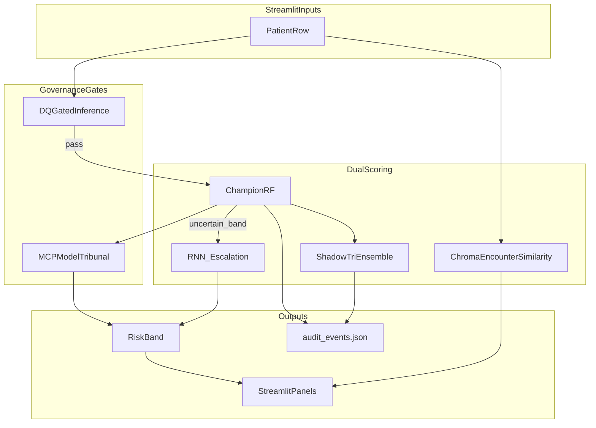

# Advanced Inference Features

Interview-ready narrative for the five differentiated inference capabilities added on top of the champion Random Forest pipeline.

## Overview

| # | Feature | Module | When it runs |
|---|---------|--------|--------------|
| 1 | **Uncertainty-gated RF + RNN routing** | `inference/routing.py` | Predict tab — RF prob in uncertainty band |
| 2 | **Encounter similarity (Chroma)** | `mcp/services/similarity_svc.py` | Predict tab expander + chat |
| 3 | **Shadow champion vs tri_ensemble** | `inference/shadow.py` | Predict tab expander |
| 4 | **DQ-gated live inference** | `governance/dq_rules.py` | Predict tab — before scoring |
| 5 | **MCP Model Tribunal (LangGraph)** | `inference/tribunal.py` | Chat tab — multi-gate routing |



---

## 1. Uncertainty-gated RF + RNN routing (best idea)

**Problem:** The experiment matrix winner is `tri_ensemble`, but the served champion is RF for interpretability. RNN sequence models capture diagnosis/medication patterns RF misses — but running RNN on every row is slow.

**Solution:** Escalate to RNN only when RF is *uncertain* (probability in a configurable band).

| Env var | Default | Meaning |
|---------|---------|---------|
| `UNCERTAINTY_LOW` | `0.35` | Lower bound of uncertainty band |
| `UNCERTAINTY_HIGH` | `0.55` | Upper bound of uncertainty band |

When `UNCERTAINTY_LOW <= rf_prob <= UNCERTAINTY_HIGH`, load `models/rnn_primary.pt` and blend RF + RNN (default: average). UI shows `route=rf_only` or `route=rf_rnn_blend`.

**Artifacts:** `models/rnn_primary.pt`, `models/rnn_token_maps.json`, `models/routing_config.json`

**Train:** Phase 3 persist cell or `python scripts/train_advanced_artifacts.py`

---

## 2. Encounter similarity via Chroma

**Concept:** *"Similar historical encounters had X% 30-day readmission."*

- Collection: `encounter_neighbors` (separate from `project_knowledge`)
- Embedding text: LOS, visits, meds, age, gender
- Index: `python scripts/index_encounter_neighbors.py` (10k sample for demo speed)

| Env var | Default |
|---------|---------|
| `CHROMA_NEIGHBORS_K` | `5` |
| `CHROMA_NEIGHBOR_COLLECTION` | `encounter_neighbors` |

---

## 3. Shadow champion vs tri_ensemble

**Problem:** Matrix winner `tri_ensemble` is not served; disagreement with champion is invisible.

**Solution:** Score shadow `VotingClassifier` (XGB + LGBM + CatBoost) alongside RF. Flag `DISAGREEMENT` when `|rf - shadow| > SHADOW_DISAGREE_TOL` (default `0.15`).

**Artifacts:** `models/shadow_tri_ensemble.joblib`, `models/shadow_register.json`

Shadow boosters and the primary RNN are trained with hyperparameters from `models/hyperparams.yaml` (written by `scripts/tune_hyperparams.py` or Phase 3 §4b). Set `SKIP_TUNING=1` to reuse the last tuned file without re-searching.

**Matrix context:** Phase 3 §7 stacking uses LightGBM + CatBoost + XGBoost (not LR/RF/XGB). Served champion is typically RF; shadow monitors the matrix-winning `tri_ensemble` (XGB + LGBM + CatBoost).

**BI export:** `data/exports/mart_shadow_disagreement.csv` (Phase 4 optional cell)

---

## 4. DQ-gated live inference

**Concept:** Apply Phase 0 data-quality rules at scoring time — refuse bad inputs before any model runs.

Checks in `governance/dq_rules.py`:
- LOS in `[1, 14]`
- Gender in allowed domain
- No placeholder values (`?`, `Unknown`, empty)
- Required numeric fields non-null

On failure: `st.error` with reason codes, audit route `dq_blocked`, no score.

---

## 5. MCP Model Tribunal (LangGraph)

Multi-gate workflow where each node represents a governance stakeholder:

| Node | Checks |
|------|--------|
| `ClinicalGuard` | Refuse prescribe/diagnose patterns |
| `ConfigGate` | Champion + datafile registry readable |
| `ToolRouter` | script / pandas / chroma / sqlite / fred / similarity |
| `FairnessGate` | Warn if gender recall gap > `FAIRNESS_RECALL_GAP_WARN` |
| `Audit` | `pool.audit` with tribunal metadata |

**Notebook:** `notebooks/phase5_langgraph_app.ipynb` §10c — `route_message_tribunal_graph()`

**Streamlit:** Chat tab checkbox **MCP Model Tribunal** (default on)

---

## Environment variables (summary)

| Variable | Default | Purpose |
|----------|---------|---------|
| `SKIP_TUNING` | `0` | `1` = skip search, reuse `models/hyperparams.yaml` |
| `TUNING_N_ITER` | `25` | RandomizedSearchCV iterations per tabular model |
| `TUNING_CV` | `3` | CV folds for tabular tuning |
| `RNN_OPTUNA_TRIALS` | `20` | Optuna trials for RNN |
| `UNCERTAINTY_LOW` | `0.35` | RNN escalation lower bound |
| `UNCERTAINTY_HIGH` | `0.55` | RNN escalation upper bound |
| `SHADOW_DISAGREE_TOL` | `0.15` | Champion vs shadow flag |
| `FAIRNESS_RECALL_GAP_WARN` | `0.05` | Tribunal fairness gate |
| `CHROMA_NEIGHBORS_K` | `5` | Similar cohort size |

---

## Validation checklist

```powershell
python scripts/tune_hyperparams.py
python scripts/train_advanced_artifacts.py
python scripts/index_encounter_neighbors.py
streamlit run app_streamlit.py
python scripts/mcp_healthcheck.py
```

- Predict tab shows `route=rf_only` or `route=rf_rnn_blend`
- Similar cohort panel returns neighbor readmission rate
- Shadow vs champion probabilities visible; disagreements audited
- Invalid inputs blocked by DQ gate
- Chat tribunal shows `tribunal_stages` in caption

---

*Analytics decision-support only — not a medical device.*
