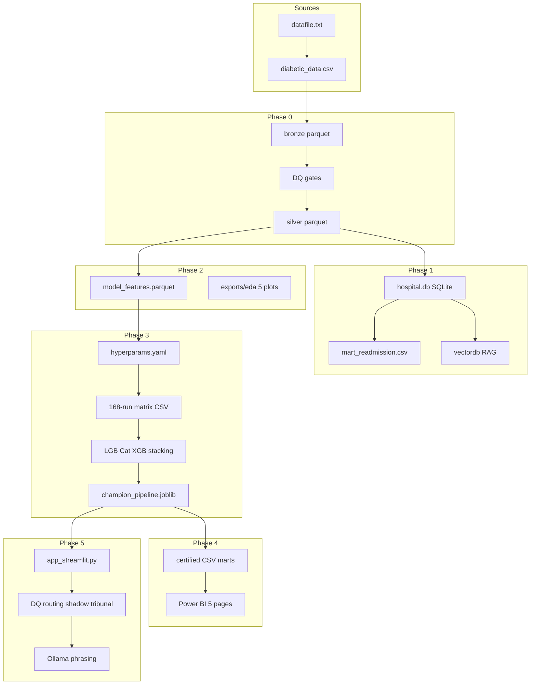

# Healthcare Patient Readmission Analysis — Full Project Architecture

> **Intended use:** Analytics decision-support for training and portfolio demonstration only. **Not** a medical device and **not** for standalone clinical decisions.

This document explains the **end-to-end architecture** so you can walk through every step in a presentation or interview.

## Architecture diagrams

| Asset | Description |
|-------|-------------|
| [`../final architecture v2.png`](../final%20architecture%20v2.png) | **Latest** full diagram (pipeline + MCP + advanced inference) |
| [`../final architecture v2.mmd`](../final%20architecture%20v2.mmd) | Editable Mermaid source for v2 |
| [`diagrams/project_architecture.png`](diagrams/project_architecture.png) | Compact phase flowchart |
| [`diagrams/project_architecture.mmd`](diagrams/project_architecture.mmd) | Editable compact Mermaid |
| [`diagrams/mcp_architecture.mmd`](diagrams/mcp_architecture.mmd) | MCP two-layer diagram |

**Regenerate:**

```powershell
python scripts/render_final_architecture_v2.py   # root v2 PNG
python scripts/render_architecture_png.py        # docs/diagrams compact PNG
```

---

## 1. Executive summary

| Item | Detail |
|------|--------|
| **Problem** | Predict which hospital patients are at elevated risk of **30-day unplanned readmission** |
| **Dataset** | Diabetes 130-US Hospitals (`diabetic_data.csv`, ~101,766 encounters) |
| **Pattern** | Medallion lake → SQLite Kimball warehouse → stats/features → ML matrix + MRM → Power BI → Streamlit + MCP |
| **Orchestrator** | [`master.ipynb`](../master.ipynb) runs Phase 0 → 5 (fail-fast) |
| **Path registry** | [`datafile.txt`](../datafile.txt) — 17 registered artifacts |
| **Environment** | Single `.venv`, Jupyter kernel **Hospital Project (.venv)** |
| **MCP** | 18 servers — IDE (Cursor) + runtime (`mcp/client/pool.py`) — see [`mcp.md`](mcp.md) |

**Warehouse note:** `hospital.db` is **SQLite** (swappable via `DATABASE_URL`). This is portfolio-scale analytics, not a distributed big-data warehouse.

---

## 2. End-to-end flowchart (compact)



Full detail: [`final architecture v2.mmd`](../final%20architecture%20v2.mmd).

---

## 3. Data zones (medallion lake)

| Zone | Folder | Example | Who reads it |
|------|--------|---------|--------------|
| **Raw** | `data/raw/` | `diabetic_data.csv` | Phase 0 |
| **Bronze** | `data/lake/bronze/` | `encounters_raw.parquet` | Lineage |
| **Silver** | `data/lake/silver/` | `encounters.parquet` | Phases 1–2 |
| **Gold** | `data/lake/gold/` | `model_features.parquet`, `experiment_results.parquet` | Phases 3–4 |
| **Export** | `data/exports/` | `mart_*.csv`, `experiments_matrix.csv` | Power BI, Streamlit |
| **Ops** | `models/`, `data/nosql/`, `data/vectordb/` | `champion_register.json`, Chroma | App, audits |

**Rule:** Power BI and the clinician app use **export** and **ops** only — never bronze.

---

## 4. Phase-by-phase walkthrough

### Phase 0 — Ingestion and governance

| | |
|---|---|
| **Notebook** | [`notebooks/phase0_ingestion_lake_governance.ipynb`](../notebooks/phase0_ingestion_lake_governance.ipynb) |
| **Doc** | [`phase0_ingestion_lake_governance.md`](phase0_ingestion_lake_governance.md) |

Bronze → DQ (8 checks, fail-fast) → silver → manifest, RBAC, `mart_dq_scorecard.csv`.

---

### Phase 1 — SQL modeling and marts

| | |
|---|---|
| **Notebook** | [`notebooks/phase1_modeling_marts_sql.ipynb`](../notebooks/phase1_modeling_marts_sql.ipynb) |
| **Doc** | [`phase1_modeling_marts_sql.md`](phase1_modeling_marts_sql.md) |

Kimball `hospital.db`, 12 SQL queries, `mart_readmission.csv`, metric dictionary, RAG + Chroma seed.

---

### Phase 2 — Stats and features

| | |
|---|---|
| **Notebook** | [`notebooks/phase2_stats_features.ipynb`](../notebooks/phase2_stats_features.ipynb) |
| **Doc** | [`phase2_stats_features.md`](phase2_stats_features.md) |

5 inline EDA plots, inferential stats, leakage-safe gold features + RNN sequences.

---

### Phase 3 — ML matrix and model risk

| | |
|---|---|
| **Notebook** | [`notebooks/phase3_ml_experiments.ipynb`](../notebooks/phase3_ml_experiments.ipynb) |
| **Doc** | [`phase3_ml_experiments.md`](phase3_ml_experiments.md) |

**Pipeline:** helpers → tune (`hyperparams.yaml`) → cohort → **168-run matrix** → **LGB/Cat/XGB stacking** → champion → fairness/SHAP → persist.

**Models:** logreg, rf, xgboost, lightgbm, catboost, rnn + gb/tri ensembles.

**Key outputs:** `experiments_matrix.csv` (168×13), `experiment_results.parquet` (169 incl. stacking), `champion_pipeline.joblib`, advanced artifacts for inference layer.

**Shared code:** `ml/` package, `scripts/tune_hyperparams.py`, `scripts/train_advanced_artifacts.py`.

---

### Phase 4 — Power BI exports

| | |
|---|---|
| **Notebook** | [`notebooks/phase4_powerbi_exports.ipynb`](../notebooks/phase4_powerbi_exports.ipynb) |
| **Doc** | [`phase4_powerbi_dashboard.md`](phase4_powerbi_dashboard.md) |

Certified marts + `kpi_snapshot.json` → Power BI Desktop (5 pages).

---

### Phase 5 — Clinician app

| | |
|---|---|
| **Notebook** | [`notebooks/phase5_langgraph_app.ipynb`](../notebooks/phase5_langgraph_app.ipynb) |
| **App** | [`app_streamlit.py`](../app_streamlit.py) |
| **Doc** | [`phase5_langgraph_app.md`](phase5_langgraph_app.md) |

**Predict tab:** RBAC → DQ gate → RF champion → uncertainty RNN routing → shadow tri_ensemble → Chroma similar cohort → Ollama explanation → audit.

**Chat tab:** MCP Model Tribunal or flat router (scripts / metrics / RAG / SQLite / FRED).

See [`ADVANCED_INFERENCE.md`](ADVANCED_INFERENCE.md).

---

## 5. Advanced inference layer

Five capabilities beyond plain champion scoring:

| # | Feature | Module |
|---|---------|--------|
| 1 | Uncertainty-gated RF + RNN | `inference/routing.py` |
| 2 | Encounter similarity (Chroma) | `mcp/services/similarity_svc.py` |
| 3 | Shadow tri_ensemble | `inference/shadow.py` |
| 4 | DQ-gated live inference | `governance/dq_rules.py` |
| 5 | MCP Model Tribunal | `inference/tribunal.py` |

---

## 6. MCP integration layer

18 MCP servers for Cursor development and Streamlit runtime. Full inventory and phase mapping: [`mcp.md`](mcp.md).

```powershell
docker compose -f docker-compose.mcp.yml up -d
python scripts/mcp_healthcheck.py
```

---

## 7. Orchestration

[`master.ipynb`](../master.ipynb) — Phase 0 → 5 sequential, fail-fast on errors.

**Utility scripts:**

| Script | Purpose |
|--------|---------|
| `scripts/tune_hyperparams.py` | Standalone hyperparameter search |
| `scripts/train_advanced_artifacts.py` | RNN + shadow + routing config |
| `scripts/index_encounter_neighbors.py` | Chroma neighbor index |
| `scripts/mcp_healthcheck.py` | MCP infrastructure check |
| `scripts/render_final_architecture_v2.py` | Architecture diagram PNG |

---

## 8. Security and governance

| Control | Location |
|---------|----------|
| RBAC | `data/nosql/rbac_roles.json` |
| PHI | `encounter_id`, `patient_nbr` restricted for viewer |
| Audit | `data/nosql/audit_events.json` |
| Model card | `models/model_card.json` |
| Champion register | `models/champion_register.json` |

---

## 9. Phase documentation index

| Phase | Doc |
|------:|-----|
| 0 | [`phase0_ingestion_lake_governance.md`](phase0_ingestion_lake_governance.md) |
| 1 | [`phase1_modeling_marts_sql.md`](phase1_modeling_marts_sql.md) |
| 2 | [`phase2_stats_features.md`](phase2_stats_features.md) |
| 3 | [`phase3_ml_experiments.md`](phase3_ml_experiments.md) |
| 4 | [`phase4_powerbi_dashboard.md`](phase4_powerbi_dashboard.md) |
| 5 | [`phase5_langgraph_app.md`](phase5_langgraph_app.md) |
| — | [`ADVANCED_INFERENCE.md`](ADVANCED_INFERENCE.md) |
| — | [`mcp.md`](mcp.md) |
