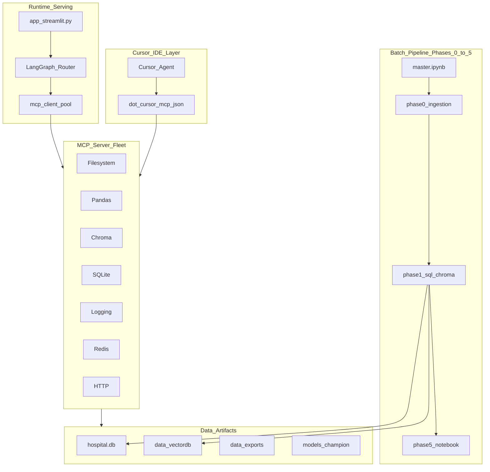
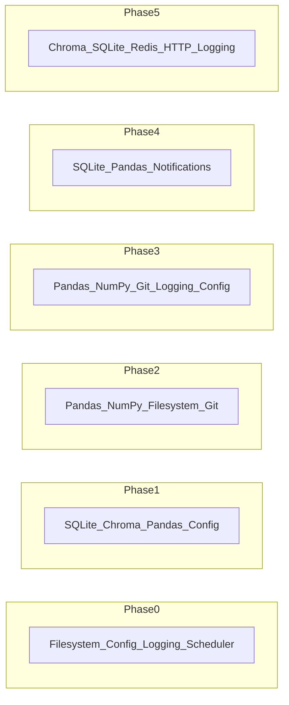
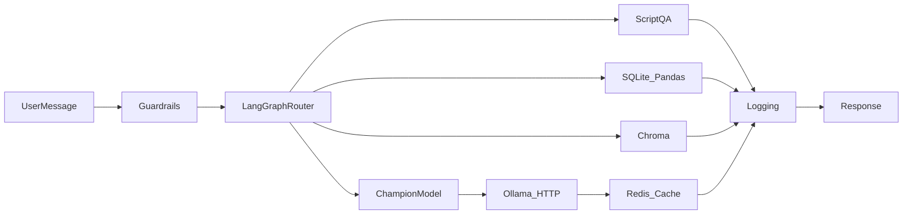

# Hospital Project — MCP Architecture Report

> **Model Context Protocol (MCP)** connects AI agents and the clinician app to project data, tools, and infrastructure through a standardized tool interface.

**Related:** [Project architecture](PROJECT_ARCHITECTURE.md) | [Advanced inference](ADVANCED_INFERENCE.md) | [Mermaid source](diagrams/mcp_architecture.mmd) | [Full architecture v2](../final%20architecture%20v2.mmd) | [Cursor config](../.cursor/mcp.json) | [MCP package README](../mcp/README.md)

---

## 1. Executive summary

This project uses MCP in **two layers**:

| Layer | Purpose | Who uses it |
|-------|---------|-------------|
| **IDE MCP (Cursor)** | Develop, debug, query warehouse, inspect git, schedule pipeline runs | You + Cursor agent |
| **Runtime MCP (App)** | Streamlit chat, semantic RAG, metrics, audit, Ollama cache | Clinician app users |

Batch notebooks (Phase 0–5) remain the pipeline; MCP is the **operational integration layer** around them.

### 18-server inventory

| # | MCP | Type | Layer | Status |
|---|-----|------|-------|--------|
| 1 | Filesystem | Official (`@modelcontextprotocol/server-filesystem`) | IDE | Configured |
| 2 | Python | Runtime (`.venv` + `PYTHONPATH`) | Both | Via project interpreter |
| 3 | Pandas | Custom (`mcp/servers/pandas_server.py`) | Both | Implemented |
| 4 | NumPy | Custom (`mcp/servers/numpy_server.py`) | Both | Implemented |
| 5 | Chroma | Official + custom wrapper | Both | Implemented |
| 6 | SQLite | Official + custom read-only tools | Both | Implemented |
| 7 | Terminal | Cursor built-in shell | IDE | Available |
| 8 | Git | Official (`mcp-server-git`) | IDE | Configured |
| 9 | Logging | Custom (`mcp/servers/logging_server.py`) | Both | Implemented |
| 10 | Config | Custom (`mcp/servers/config_server.py`) | Both | Implemented |
| 11 | Clipboard | OS / IDE | IDE | Manual (dev only) |
| 12 | Notifications | Custom (`mcp/servers/notifications_server.py`) | IDE + ops | Implemented |
| 13 | Scheduler | Custom (`mcp/servers/scheduler_server.py`) | IDE | Implemented |
| 14 | Browser | Cursor Browse plugin | IDE | Available |
| 15 | HTTP | Official fetch + custom Ollama tools | Both | Implemented |
| 16 | FRED | Custom (`mcp/servers/fred_server.py`) | Analyst stretch | Implemented |
| 17 | MQTT | Custom (`mcp/servers/mqtt_server.py`) | Demo IoT stretch | Implemented |
| 18 | Redis | Official (`mcp-redis`) + service layer | Runtime | Implemented |

---

## 2. Architecture diagrams

### 2.1 Two-layer MCP architecture



### 2.2 Phase-to-MCP mapping



| Phase | Notebook / App | Primary MCPs | Concrete use |
|-------|----------------|--------------|--------------|
| **0** | `phase0_ingestion_lake_governance.ipynb` | Filesystem, Config, Logging, Scheduler, Terminal | Validate `datafile.txt`; log DQ failures; schedule ingest |
| **1** | `phase1_modeling_marts_sql.ipynb` | SQLite, Chroma, Pandas, Config | Build `hospital.db`; seed `project_knowledge` vectors |
| **2** | `phase2_stats_features.ipynb` | Pandas, NumPy, Filesystem, Git | EDA on gold parquet; track feature dictionary |
| **3** | `phase3_ml_experiments.ipynb` | Pandas, NumPy, Git, Logging, Config | Experiment matrix (168 runs), `experiments_matrix.csv`, champion register |
| **4** | `phase4_powerbi_exports.ipynb` | SQLite, Pandas, Notifications | Refresh marts; KPI drift alerts |
| **5** | `app_streamlit.py`, `phase5_langgraph_app.ipynb` | Chroma, SQLite, Redis, HTTP, Logging, Browser | RAG chat, metrics, Ollama phrasing, E2E UI |
| **Ops** | `master.ipynb` | Scheduler, Git, Logging, Terminal | Full pipeline orchestration |
| **Stretch** | IoT / analyst demo | MQTT, FRED, Redis | Simulated vitals; macro context (non-clinical) |

---

## 3. Per-MCP deep dive

### 3.1 Filesystem MCP

- **What:** Secure read/write/list within scoped directories.
- **Why:** Inspect lake zones, manifests, exports, model cards without manual path hunting.
- **Project use:** Phase 0 bronze/silver paths; `datafile.txt`; `models/champion_register.json`.
- **Example:** “List files in `data/exports`” → filesystem list_dir.
- **Setup:** `npx -y @modelcontextprotocol/server-filesystem "<project-root>"`
- **Security:** Scoped to project root only in `.cursor/mcp.json`.

### 3.2 Python MCP

- **What:** Execute Python in project `.venv` with correct `PYTHONPATH`.
- **Why:** Reproduce notebook logic, smoke-test champion pipeline, debug dtype issues.
- **Project use:** All phases; `mcp.services.*` importable from pool.
- **Setup:** Use workspace interpreter `${workspaceFolder}/.venv/Scripts/python.exe`.

### 3.3 Pandas MCP

- **What:** Load certified marts, groupby metrics, describe gold features.
- **Why:** Natural-language analytics over `mart_readmission.csv` without hardcoded if/else.
- **Project use:** Phase 2–4 EDA; Phase 5 `semantic_metric()`; `mcp/services/pandas_svc.py`.
- **Example:** “Readmission rate by age” → `semantic_metric` tool.
- **Setup:** `python -m mcp.servers.pandas_server`

### 3.4 NumPy MCP

- **What:** Array statistics and correlations on gold numeric features.
- **Why:** Fast distribution checks for ML features before champion scoring.
- **Project use:** Phase 2–3; `model_features.parquet` columns.
- **Setup:** `python -m mcp.servers.numpy_server`

### 3.5 Chroma MCP (local)

- **What:** Semantic vector search over `data/vectordb`, collection `project_knowledge`.
- **Why:** Replaces keyword-only RAG in chat; uses docs seeded in Phase 1.
- **Project use:** Phase 1 seed; Phase 5 `vector_rag` route; `mcp/services/chroma_svc.py`.
- **Setup:** Official `uvx chroma-mcp` + custom `python -m mcp.servers.chroma_server`

### 3.6 SQLite MCP

- **What:** Read-only SELECT + schema inspection on `data/warehouse/hospital.db`.
- **Why:** Chat can answer SQL questions beyond two hardcoded metrics.
- **Project use:** Phase 1 warehouse; Phase 5 semantic SQL route.
- **Setup:** `uvx mcp-server-sqlite --db-path data/warehouse/hospital.db`

### 3.7 Terminal MCP

- **What:** Run shell commands in project directory.
- **Why:** Execute `master.ipynb`, `streamlit run`, health checks.
- **Project use:** Ops; `scripts/mcp_healthcheck.py`.
- **Setup:** Cursor integrated terminal (no extra server).

### 3.8 Git MCP (local)

- **What:** Log, diff, blame on local repository.
- **Why:** Track champion register changes, notebook edits, registry updates.
- **Project use:** `models/champion_register.json`, `datafile.txt` history.
- **Setup:** `uvx mcp-server-git --repository <project-root>`

### 3.9 Logging MCP

- **What:** Append/read `audit_events.json` and `pipeline_runs.json`.
- **Why:** Centralized governance trail for predictions and chat routes.
- **Project use:** Phase 5 audit; all RBAC actions.
- **Setup:** `python -m mcp.servers.logging_server`

### 3.10 Config MCP

- **What:** Read `datafile.txt`, RBAC, champion register, env summary.
- **Why:** Single config surface for agents and runtime router.
- **Project use:** Every phase path discovery; Streamlit sidebar metadata.
- **Setup:** `python -m mcp.servers.config_server`

### 3.11 Clipboard MCP

- **What:** Copy/paste text between agent and user desktop.
- **Why:** Quick share of KPI snippets or SQL results during demos.
- **Project use:** IDE-only; presentation workflow.
- **Setup:** OS clipboard or IDE extension (optional).

### 3.12 Notifications MCP

- **What:** Log notifications to `data/nosql/mcp_notifications.json`; optional Windows toast.
- **Why:** Alert on DQ failure, champion drift, pipeline completion.
- **Project use:** Phase 4 KPI refresh; scheduler job completion.
- **Setup:** `python -m mcp.servers.notifications_server`

### 3.13 Scheduler MCP

- **What:** Register and run jobs (e.g. `master.ipynb` end-to-end).
- **Why:** Automate nightly pipeline without manual notebook clicks.
- **Project use:** Ops; `mcp/services/scheduler_svc.py`.
- **Setup:** `python -m mcp.servers.scheduler_server`

### 3.14 Browser MCP (local)

- **What:** E2E UI automation for Streamlit at `localhost:8501`.
- **Why:** Verify risk bands, disclaimers, chat routing, RBAC errors.
- **Project use:** Phase 5 QA.
- **Setup:** Cursor Browse plugin (already available in IDE).

### 3.15 HTTP MCP (local)

- **What:** Fetch URLs + Ollama health/generate via `OLLAMA_URL`.
- **Why:** Reliable LLM phrasing with health probes before predict explanations.
- **Project use:** Phase 5 `ollama_phrase()`; `mcp/services/http_svc.py`.
- **Setup:** `uvx mcp-server-fetch` + `python -m mcp.servers.http_sqlite_server`

### 3.16 FRED MCP (local)

- **What:** Fetch St. Louis Fed macro series (UNRATE, CPI).
- **Why:** **Analyst socioeconomic context only** — not clinical decision input.
- **Project use:** Analyst chat stretch; never fed to champion model.
- **Setup:** Set `FRED_API_KEY`; `python -m mcp.servers.fred_server`

### 3.17 MQTT MCP (local broker)

- **What:** Publish/subscribe on `hospital/vitals/{patient_id}` via Mosquitto.
- **Why:** Demo real-time vitals stream for portfolio “hospital IoT” story.
- **Project use:** Stretch demo; not in champion features.
- **Setup:** `docker compose -f docker-compose.mcp.yml up -d`; `python -m mcp.servers.mqtt_server`

### 3.18 Redis MCP (local)

- **What:** Key-value cache for Ollama explanations and config hot-reload.
- **Why:** Faster repeat predictions; rate-limit chat per role.
- **Project use:** Phase 5 `MCPPool.ollama_phrase()` cache.
- **Setup:** `docker compose -f docker-compose.mcp.yml up -d`; `uvx mcp-redis`

---

## 4. Runtime integration (Streamlit + LangGraph)



**Implementation files:**

- [`mcp/client/pool.py`](../mcp/client/pool.py) — shared service layer (MCP-equivalent at runtime)
- [`app_streamlit.py`](../app_streamlit.py) — imports `pool` for audit, RAG, metrics, Ollama cache
- [`notebooks/phase5_langgraph_app.ipynb`](../notebooks/phase5_langgraph_app.ipynb) — LangGraph `StateGraph` router

**Fallback behavior:** If Redis/Chroma/MQTT are offline, pool falls back to inline services (keyword RAG, no cache) so Streamlit still runs.

---

## 5. Setup and operations

### Prerequisites

- Python 3.12+ with project `.venv`
- Node.js (for `npx` official MCP servers)
- `uv` (for `uvx` official MCP servers)
- Docker Desktop (optional, for Redis + Mosquitto)

### Install dependencies

```powershell
cd "E:\Amit\Project\Hospital project"
.\.venv\Scripts\Activate.ps1
pip install -r requirements.txt
```

### Start local infrastructure

```powershell
docker compose -f docker-compose.mcp.yml up -d
```

### Health check

```powershell
python scripts/mcp_healthcheck.py
```

### Cursor MCP

1. Open project in Cursor.
2. Config lives at [`.cursor/mcp.json`](../.cursor/mcp.json).
3. Reload MCP servers in **Settings → Tools & MCP**.
4. Run pipeline first so `hospital.db` and `data/vectordb` exist.

### Environment variables

| Variable | Default | Purpose |
|----------|---------|---------|
| `DATABASE_URL` | `sqlite:///data/warehouse/hospital.db` | SQLAlchemy warehouse |
| `OLLAMA_URL` | `http://localhost:11434` | LLM phrasing |
| `REDIS_URL` | `redis://localhost:6379/0` | Explanation cache |
| `MQTT_BROKER` | `localhost` | Vitals demo |
| `MQTT_PORT` | `1883` | Mosquitto |
| `FRED_API_KEY` | (empty) | FRED analyst tools |
| `CHROMA_COLLECTION` | `project_knowledge` | Vector collection name |
| `CHROMA_NEIGHBOR_COLLECTION` | `encounter_neighbors` | Similar-cohort collection |
| `UNCERTAINTY_LOW` / `UNCERTAINTY_HIGH` | `0.35` / `0.55` | RF→RNN routing band |
| `SHADOW_DISAGREE_TOL` | `0.15` | Shadow disagreement flag |
| `CHROMA_NEIGHBORS_K` | `5` | Similar cohort size |

---

## 5b. Advanced inference features

Five capabilities beyond plain champion scoring — full narrative in [`ADVANCED_INFERENCE.md`](ADVANCED_INFERENCE.md):

1. **Uncertainty-gated RF + RNN** — `inference/routing.py`, artifacts from Phase 3 / `scripts/train_advanced_artifacts.py`
2. **Encounter similarity** — `mcp/services/similarity_svc.py`, `scripts/index_encounter_neighbors.py`
3. **Shadow tri_ensemble** — `inference/shadow.py`, `models/shadow_tri_ensemble.joblib`
4. **DQ-gated inference** — `governance/dq_rules.py`
5. **MCP Model Tribunal** — `inference/tribunal.py`, Phase 5 LangGraph §10c

### Troubleshooting

| Issue | Fix |
|-------|-----|
| `hospital.db` missing | Run Phase 1 or `master.ipynb` |
| Chroma empty | Re-run Phase 1 Chroma cell |
| Redis offline | `docker compose -f docker-compose.mcp.yml up -d` |
| Custom MCP import error | Set `PYTHONPATH` to project root |
| Ollama timeout | `ollama pull deepseek-r1` and `ollama pull llama3` |

---

## 6. Security and governance

| Control | MCP interaction |
|---------|-----------------|
| RBAC | Config MCP reads `rbac_roles.json`; Streamlit enforces roles |
| Audit | Logging MCP writes `audit_events.json` (last 500 events) |
| SQLite chat | **SELECT only** in custom sqlite tools |
| FRED / MQTT | Analyst/demo only — never champion model features |
| Filesystem | Scoped to project root in Cursor config |

---

## 7. Advantages summary

| Benefit | MCPs involved |
|---------|---------------|
| Faster development debugging | Filesystem, Git, Terminal, SQLite |
| Semantic clinician chat | Chroma, Pandas, SQLite |
| Governance & lineage | Logging, Config, Scheduler |
| Performance at scale | Redis |
| Portfolio differentiation | MQTT, FRED, Browser E2E |
| Reproducible ops | Scheduler, Notifications, Git |

---

*Analytics decision-support only — not a medical device.*
